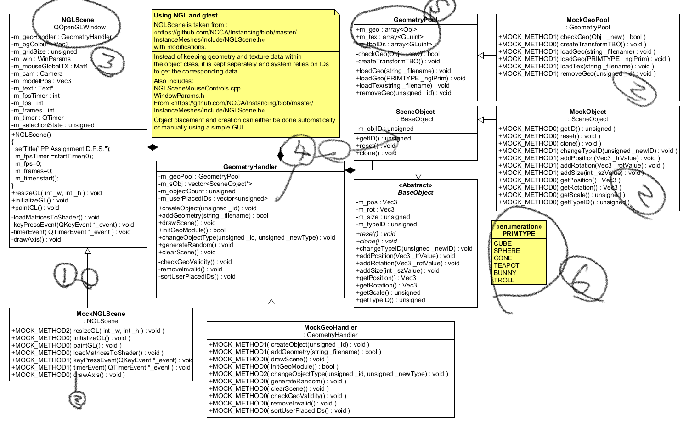

## General Feedback

In general, a lot of the class diagrams are not showing the attributes properly, you should re-visit your classes now and see if you can actually write code for them/

Follow the guidelines [here](http://jonmacey.blogspot.co.uk/2013/01/ca-1-initial-design-general-feedback.html) for more information as well as [this](http://jonmacey.blogspot.co.uk/2011/01/asd-ca1-assignment-feedback-and.html)

Your main program loop can also be written very quickly to test it, use print statements and dummy classes to make sure you can effectively wire-up your different classes and let them interact, again this can be done with just print outs and no graphical elements, this will make any errors / design flaws apparent very quickly. Best way to do this is to read the [following](http://jonmacey.blogspot.co.uk/2012/02/getting-started-with-programming.html) posts

## Specific Feedback

It is hard to see what the actual project is from your very brief description. It needs some more detail to explain.

It seems that you are making some form of [scenegraph](https://en.wikipedia.org/wiki/Scene_graph) in which case you will really need some way of generating this and the other elements (shaders, transforms, light camera's etc) from a description such as a file. I would suggest using either JSON (rapid Json is included in NGL) or xml for the file format.

## Class Diagram

1. You need to show the links between the classes and multiplicity 
2. No need to show the mocking in the design, this is just for the testing.
3. NGLScene is really an implementation detail in this case, what if you use you lib with SDL or GLFW?
4. It is hard to see what the relation between GeometryHandler and GeometryPool is.
  
    > Handler is a bad name as it is a verb
    
    > Whilst GeometeryPool implies it is a pool pattern it doesn't seem to be used as such here (why do we need to re-use these things as they are unique entities)

5. You are using array (I guess std::array), these are allocated on the heap so can't expand, you should be using std::vector.

6. This is a limited number of primitives, I would use proper meshes.

This is going to need more work to make it into a proper scene / layout tool. As I suggested above look at scenegraphs as a solution (or how systems such as unreal do it)